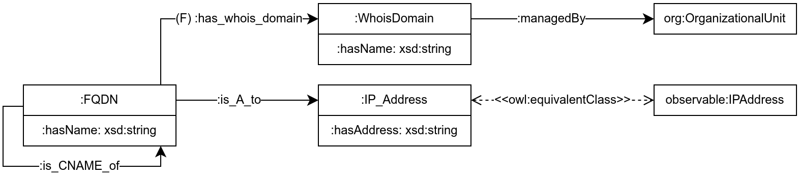
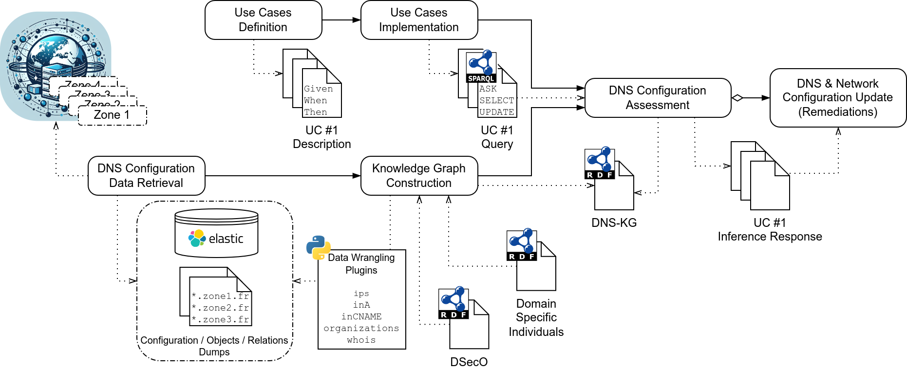

# DNS Security Ontology (DSecO)

The **DSecO** project is a data model for representing and reasoning on Domain Name System (DNS) data.
The ontology is developed using web technologies (e.g. RDF, OWL, SKOS) and is intended as a structure for realizing a DNS Knowledge Graph (DNS-KG) for administration and security assessment applications.
The model has been developed in collaboration with operational teams, and in connection with third parties linked vocabularies.

Cite:

```bibtex
@misc{dseco-2025,
  title     = {{DSecO: Domain Name System (DNS) Data as a Knowledge Graph for Enhanced Security Analysis}},
  author    = {{Didier Bringer} and {Lionel Tailhardat}},
  year      = {2025}
}
```

Overview of the data model:



Overview of the DNS-KG approach:



## Usage

We provide a direct access to the DSecO resources with the **dseco** [w3id.org](https://w3id.org/) identifier:
> [https://w3id.org/dseco/](https://w3id.org/dseco/)

Based on this identifier, the following links apply for direct access to the NORIA-O featured topics:

| DSecO         | Link                               |
|---------------|------------------------------------|
| Ontologies    | https://w3id.org/dseco/ontology/   |
| Documentation | https://w3id.org/dseco/doc/        |

## Copyright

Copyright (c) 2023-2025, Orange. All rights reserved.

## License

[BSD-4-Clause](LICENSE.txt).

## Maintainer

* [Didier BRINGER](mailto:didier.bringer@orange.com)
* [Lionel TAILHARDAT](mailto:lionel.tailhardat@orange.com)
